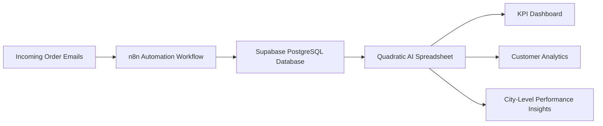

# 📦 End-to-End Supply Chain Analytics Project


## 📌 Project Overview

This project demonstrates a **real-world end-to-end supply chain analytics pipeline** that automates order ingestion and generates logistics performance KPIs using **AI-powered spreadsheet analytics and workflow automation tools**.

The system integrates:

* Email-based order ingestion
* Automated workflow pipelines
* Cloud-hosted PostgreSQL database
* AI-driven KPI analytics dashboards

to monitor **delivery performance, fulfillment efficiency, and customer-level service metrics**.

---

# 🏗️ System Architecture



---

# ⚙️ Tech Stack

| Tool                      | Role                             |
| ------------------------- | -------------------------------- |
| n8n                       | Workflow automation              |
| Supabase                  | Cloud database hosting           |
| PostgreSQL                | Structured storage layer         |
| Quadratic                 | AI-powered spreadsheet analytics |
| Python (inside Quadratic) | KPI calculations                 |

---

# 🔄 Data Pipeline Workflow

```
Email Orders → n8n → PostgreSQL (Supabase) → Quadratic → KPI Dashboard & Insights
```

### Pipeline Features

✔ Automated order ingestion
✔ Cloud database storage
✔ Real-time analytics connection
✔ AI-assisted KPI generation
✔ Cross-validation with source database

---

# 📊 Supply Chain KPIs Implemented

Industry-standard logistics KPIs tracked:

* Total Order Lines
* Total Orders
* Line Fill Rate
* Volume Fill Rate
* On-Time Delivery %
* In-Full Delivery %
* On-Time In-Full %
* Customer-Level Delivery Performance

These KPIs help monitor:

✔ inventory availability
✔ fulfillment accuracy
✔ delivery reliability
✔ service-level compliance

---

# 🔎 Business Insights Generated

Using Quadratic AI analytics:

### 📍 City-Level Insights

* Monthly On-Time Delivery % by city
* Delivery performance comparison across regions

### 👥 Customer-Level Insights

Top 5 customers identified by:

* Order value
* OTIF %
* IF %
* OT %

### 🇮🇳 India-Level Insights

* Top 5 customers in India by revenue contribution
* Service performance benchmarking

These insights support:

✔ logistics optimization
✔ customer prioritization
✔ SLA monitoring
✔ fulfillment performance tracking

---

# 🤖 AI Prompt Engineering (Quadratic)

AI prompting used for:

* KPI table generation
* automated analytics queries
* performance summaries
* delivery benchmarking
* dataset validation

Prompts available here:

```
prompts_used.md
```

---

# 📂 Repository Structure

```
├── n8n_workflows/
│   └── My_workflow.json
│
├── screenshots/
│   ├── n8n-workflow.png
│   ├── KPI_sheet.png
│   └── Top 5 customers by order value.png
│
├── prompts_used.md
└── README.md


---

# 📸 Project Screenshots

### n8n Workflow Automation


### KPI Dashboard (Quadratic)

```
screenshots/KPI_sheet.png
```

### Customer Performance Analytics

```
screenshots/Top 5 customers by order value.png
```

---

# 🚀 Key Learnings

Through this project I gained hands-on experience in:

* building automated ETL pipelines using n8n
* integrating Supabase PostgreSQL with analytics tools
* designing supply chain KPI dashboards
* implementing OTIF performance tracking
* validating analytics outputs with database records
* applying AI prompting for spreadsheet analytics
* generating decision-ready logistics insights

---

# 📈 Business Value Simulation

This project replicates a **real logistics analytics workflow used by operations teams**, enabling:

✔ automated order ingestion
✔ centralized cloud data storage
✔ KPI monitoring dashboards
✔ delivery performance tracking
✔ customer-level analytics insights

---

# 👨‍💻 Author

**Ajitesh Prakash**

---

# ⭐ GitHub Repo Description (paste in description box)

Use this:

> End-to-end Supply Chain Analytics pipeline using n8n automation, Supabase PostgreSQL, and Quadratic AI spreadsheet for OTIF KPI dashboards and delivery performance insights.

---

If you upload your screenshots next, I can help you **add animated preview GIF section** (very powerful for recruiter impact 🚀).
